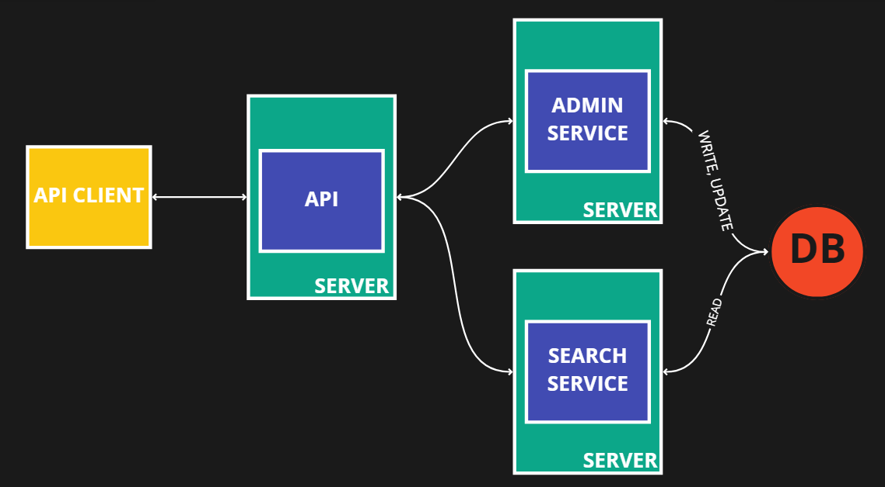

<div align="center">
  </img>
  <h1>GinyuSportsAPI</h1>
</div>

## Estructura del proyecto: Microservicios
Hemos escogido microservicios debido a que nuestros principales casos de uso:

- Búsqueda específica de partidos
- Scraping de partidos y actualización de base de datos

Son acciones complejas que no están relacionadas por lo que es factible separar cada uso en un servidor diferente de tal forma que no sea necesario detener la API cuando se necesita realizar mantenimiento en alguno de los servicios. Por ejemplo: 

- Un usuario puede estar realizando búsquedas mientras se está optimizando el algoritmo de scraping en el servicio de administrador.
- Los administradores pueden estar scrapeando nueva información mientras que se añaden nuevas funciones a las acciones de un usuarios.

### Directorios y diagrama:

```py
-cli_API
|--controlador.py
|--servicio.py

-server_ADMIN
|--controlador.py
|--dao.py
|--servicio.py
-server_API
|--controlador.py
|--servicio.py
-server_SEARCH
|--controlador.py
|--dao.py
|--servicio.py
```



## Información sobre microservicios

|puerto|servidor             |descripcion                                                                                         |
|------|---------------------|----------------------------------------------------------------------------------------------------|
|5000  | server_API          | servidor encargado de redirigir al microservicio adecuado si es un usuario o administrador         |
|5001  | server_Admin        | microservicio encargado de realizar scraping de nuevos datos y de enviarlos al BMQ                 |
|5002  | server_Search_Update| microservicio encargado de procesar consultas y poblar la base de datos                            |
|5003  | server_BMQ          | microservicio encargado de ser una cola de mensaje en caso se realicen múltiples scrapings a la vez|
|5004  | gmail_local_server  | microservicio para generar las respuestas y solicitudes con el GMAIL API                           |
|5005  | playground         | portal amigable para que los clientes prueben la api de forma resumida                                                                           |

## Comandos útiles
```yml
desde root: 
  python -m coverage run --data-file=testing/.coverage testing/test_scrap.py # EJECUTAR TESTS
  python -m coverage report --data-file=testing/.coverage # VER RESULTLADOS
  python -m coverage xml -i --data-file=testing/.coverage -o testing/coverage.xml # OBTENER XML
```